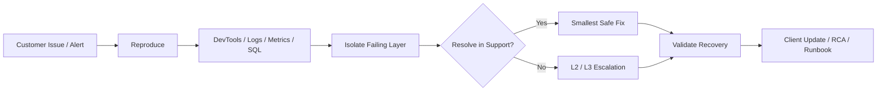

<!-- ===================== HERO ===================== -->

  

  <b>B2B SaaS · Incident Response · APIs · Databases · Observability</b>

  Technical support professional with <b>3+ years of customer-facing experience</b>. 
  I investigate customer-impacting issues using <b>Browser DevTools, logs, APIs, SQL, Linux, and monitoring</b>,
  then turn the evidence into a clear resolution, escalation, recovery check, and client update.

  
  
  
  

> **Portfolio boundary:** the engineering projects below are controlled hands-on labs built for troubleshooting practice and evidence. They do not represent employer production systems or real customer incidents.

---

# 🧭 How I Troubleshoot

  <b>Reproduce → Collect evidence → Isolate → Resolve or escalate → Validate → Document</b>

---

# 📌 Evidence Highlights

<table>
<tr>
<td width="33%" align="center">

### 8 / 8 → HTTP 503
Controlled upstream outage reproduced consistently in the B2B incident lab.

</td>
<td width="33%" align="center">

### 10 / 10 → HTTP 200
Recovery validated repeatedly after restoring the failed dependency.

</td>
<td width="33%" align="center">

### 114 → 0
RabbitMQ backlog drained after isolating a worker outage in NIGHTWATCH.

</td>
</tr>
<tr>
<td width="33%" align="center">

### ~500k rows
PostgreSQL query-plan investigation and targeted indexing in the managed-services lab.

</td>
<td width="33%" align="center">

### AWS ECS staging
OpsPilot deployed with ECS Fargate, RDS, Redis, Terraform, OIDC, and observability.

</td>
<td width="33%" align="center">

### ClickHouse + Kafka
Replicated analytics support environment with Kafka ingestion, Keeper, and diagnostics.

</td>
</tr>
</table>

---

# ⚡ Featured Support Engineering Work

<table>
<tr>
<td width="50%" valign="top">

## 🎯 B2B Incident Response Support Lab

**B2B Technical Support · Application Support**

`DevTools` `FastAPI` `PostgreSQL` `Prometheus`

- Browser DevTools + request-ID log correlation
- real upstream HTTP 503 dependency outage
- SEV-1 workflow and L1 → L2/L3 escalation
- back-office troubleshooting
- automated outage and recovery validation

</td>
<td width="50%" valign="top">

## 🌙 NIGHTWATCH Production Support Lab

**Production Support · Application Support**

`Linux` `RabbitMQ` `Redis` `PostgreSQL` `Grafana`

- queue backlog and worker outage diagnosis
- PostgreSQL locks and connection exhaustion
- Nginx / DNS / HTTP failure isolation
- Redis dependency troubleshooting
- metrics, logs, traces, and operational records

</td>
</tr>

<tr>
<td width="50%" valign="top">

## 🚦 OpsPilot

**Production Support · Cloud Support**

`AWS` `ECS` `Terraform` `PostgreSQL` `Redis`

- AWS staging environment on ECS Fargate
- SLOs, error budgets, metrics, logs, and traces
- GitHub Actions + AWS OIDC
- transactional outbox and dependency recovery
- controlled incident drills and runbooks

</td>
<td width="50%" valign="top">

## 💳 Fintech Incident Operations Lab

**Fintech · Payments Support**

`Datadog` `Prometheus` `PostgreSQL` `Redis`

- payment incident triage and reconciliation
- DLQ / queue failure investigation
- Datadog custom metrics and monitor lifecycle
- duplicate / ambiguous payment handling
- stakeholder updates and post-incident analysis

</td>
</tr>
</table>

---

# 🎯 Hiring Manager Fast Path

| Hiring for | Start here |
|---|---|
| **Technical / B2B Support** | [B2B Incident Response](https://github.com/dwaradwara/b2b-incident-response-support-lab) → [Supabase Support](https://github.com/dwaradwara/supabase-support-lab) |
| **Application / Production Support** | [NIGHTWATCH](https://github.com/dwaradwara/nightwatch-production-support-lab) → [L2 Production Support](https://github.com/dwaradwara/l2-production-support-lab) |
| **Cloud / DevOps Support** | [OpsPilot](https://github.com/dwaradwara/opspilot) → [Linux DevOps Operations](https://github.com/dwaradwara/linux-devops-operations-lab) |
| **Database / Data Platform Support** | [ClickHouse Support](https://github.com/dwaradwara/clickhouse-customer-support-lab) → [Supabase Support](https://github.com/dwaradwara/supabase-support-lab) |
| **Fintech / Payments** | [Fintech Incident Operations](https://github.com/dwaradwara/fintech-incident-operations-lab) → [Usage-Based Billing](https://github.com/dwaradwara/usage-based-billing-support-lab) |
| **Linux / Infrastructure Support** | [Ubuntu / KVM](https://github.com/dwaradwara/ubuntu-kvm-support-lab) → [Linux Infrastructure Toolkit](https://github.com/dwaradwara/linux-infrastructure-support-toolkit) |
| **AI SaaS Support** | [AI Support Specialist Lab](https://github.com/dwaradwara/ai-support-specialist-lab) |

---

# 🧰 Core Technology Stack

| Area | Technologies |
|---|---|
| **Support & troubleshooting** | Browser DevTools, REST/HTTP, JSON, logs, SQL, curl, Bash |
| **Systems & containers** | Linux, Ubuntu, Docker, Nginx, Kubernetes, KVM/libvirt |
| **Cloud & automation** | AWS, Terraform/OpenTofu, Ansible, GitHub Actions, ArgoCD |
| **Data & messaging** | PostgreSQL, Redis, ClickHouse, Kafka, RabbitMQ, Supabase |
| **Observability** | Prometheus, Grafana, Datadog, CloudWatch, OpenTelemetry, Zabbix |
| **Applications** | Python, FastAPI, Flask, Spring Boot / Java, LangSmith |

  

---

# 📚 Full Technical Portfolio

<b>View all 15 hands-on project repositories</b>

 

### Technical / Application Support

- [B2B Incident Response Support Lab](https://github.com/dwaradwara/b2b-incident-response-support-lab) — DevTools, server logs, Prometheus, critical incidents, back-office troubleshooting
- [Supabase Support Lab](https://github.com/dwaradwara/supabase-support-lab) — PostgreSQL, Auth, JWT, RLS, Storage, PostgREST, Unified Logs
- [Usage-Based Billing Support Lab](https://github.com/dwaradwara/usage-based-billing-support-lab) — billing APIs, SQL reconciliation, idempotency, Python support tooling
- [SaaS Solution Engineering Lab](https://github.com/dwaradwara/saas-solution-engineering-lab) — onboarding, API integrations, CSV mapping, customer expansion

### Production / Application Operations

- [L2 Production Support Lab](https://github.com/dwaradwara/l2-production-support-lab) — Linux, APIs, PostgreSQL, AWS, Kubernetes, observability
- [NIGHTWATCH Production Support Lab](https://github.com/dwaradwara/nightwatch-production-support-lab) — Nginx, PostgreSQL, Redis, RabbitMQ, logs, traces
- [Managed Services L2 Support Lab](https://github.com/dwaradwara/managed-services-l2-support-lab) — Spring Boot, PostgreSQL, Kubernetes, backup/recovery, monitoring
- [Fintech Incident Operations Lab](https://github.com/dwaradwara/fintech-incident-operations-lab) — payment incidents, Datadog, reconciliation, Redis, centralized logging

### Cloud / DevOps / Infrastructure

- [OpsPilot](https://github.com/dwaradwara/opspilot) — AWS ECS, RDS, Redis, Terraform, observability, CI/CD
- [Linux DevOps Operations Lab](https://github.com/dwaradwara/linux-devops-operations-lab) — Ansible, KVM, Docker, Nginx, Zabbix, Grafana
- [GitOps ArgoCD DevOps Lab](https://github.com/dwaradwara/gitops-argocd-devops-lab) — Kubernetes, ArgoCD, GitHub Actions, drift, rollback
- [Ubuntu / KVM Support Lab](https://github.com/dwaradwara/ubuntu-kvm-support-lab) — KVM/QEMU, libvirt, OpenTofu, cloud-init, Prometheus
- [Linux Infrastructure Support Toolkit](https://github.com/dwaradwara/linux-infrastructure-support-toolkit) — systemd, DNS, TLS, Docker, virtualization, storage, diagnostics

### Specialist Support

- [ClickHouse Customer Support Lab](https://github.com/dwaradwara/clickhouse-customer-support-lab) — ClickHouse, Kafka, Keeper, replication, query diagnostics
- [AI Support Specialist Lab](https://github.com/dwaradwara/ai-support-specialist-lab) — FastAPI, OpenAI, LangSmith, CloudWatch, AI incident troubleshooting

---

# 📌 Current Direction

  <b>Technical Support Engineering · Application Support · Production Support</b>

  Cloud, infrastructure, database, and observability skills support my primary focus:
  <b>diagnosing and resolving customer-impacting technical issues.</b>

---

# 🤝 Connect

  
  
  

  <b>Open to Technical Support, Application Support, and Production Support opportunities in Tbilisi / remote EMEA.</b>

 

  

