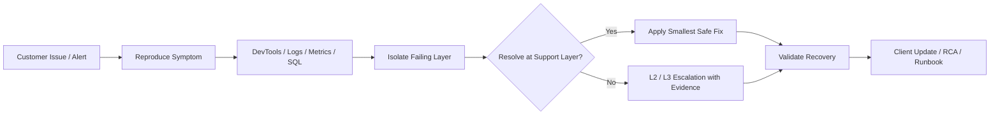

<!-- ===================== HERO ===================== -->

  

  <b>B2B SaaS · Incident Response · APIs · Databases · Observability</b>

  I investigate customer-impacting issues across
  <b>browser traffic, APIs, logs, SQL, Linux, cloud infrastructure, and monitoring</b> —
  then turn the evidence into a clear fix, escalation, recovery check, and client update.

  
  
  
  

---

# 👋 30-Second Profile

I am a technical support professional with **3+ years of customer-facing experience** and a hands-on portfolio built around production-style troubleshooting.

My work focuses on:

- reproducing customer issues instead of guessing;
- using **Browser DevTools, server logs, metrics, SQL, and system diagnostics** to isolate the failing layer;
- deciding whether an issue should be resolved at L1/L2 or escalated with complete diagnostic evidence;
- validating recovery before closure;
- writing clear customer updates, runbooks, incident timelines, and postmortems.

<table>
<tr>
<td width="33%" valign="top">

### 🔎 What I Troubleshoot

APIs & HTTP  
Authentication & authorization  
Database behavior  
Queues & integrations  
Linux & container failures  
Customer-facing incidents

</td>
<td width="33%" valign="top">

### 🛠️ What I Operate

Linux / Ubuntu  
Docker & Kubernetes  
PostgreSQL / Redis  
AWS services  
Monitoring & logging  
CI/CD workflows

</td>
<td width="33%" valign="top">

### 🧭 How I Work

Reproduce  
Collect evidence  
Isolate the failing layer  
Resolve or escalate  
Validate recovery  
Document clearly

</td>
</tr>
</table>

---

# 🧭 Incident Investigation Workflow

> **Investigate before restarting. Fix the cause, not just the symptom.**

---

# ⚡ Featured Support Engineering Work

<table>
<tr>
<td width="50%" valign="top">

## 🎯 B2B Incident Response Support Lab

**Best fit:** B2B Technical Support / Application Support

`DevTools` `FastAPI` `PostgreSQL` `Prometheus`

- Browser DevTools + request-ID correlation
- real upstream HTTP 503 outage simulation
- SEV-1 workflow and L1 → L2/L3 escalation
- back-office troubleshooting
- automated outage and recovery validation

</td>
<td width="50%" valign="top">

## 🚦 OpsPilot

**Best fit:** Production Support / Cloud Support

`AWS` `ECS` `Terraform` `PostgreSQL` `Redis`

- AWS staging environment on ECS Fargate
- SLOs, error budgets, metrics, logs, and traces
- GitHub Actions + AWS OIDC
- transactional outbox and dependency recovery
- controlled incident drills and runbooks

</td>
</tr>

<tr>
<td width="50%" valign="top">

## 🌙 NIGHTWATCH Production Support Lab

**Best fit:** Production / Application Support

`Linux` `RabbitMQ` `Redis` `PostgreSQL` `Grafana`

- queue backlog and worker outage diagnosis
- PostgreSQL locks and connection exhaustion
- Nginx / DNS / HTTP failure isolation
- Redis readiness and dependency troubleshooting
- metrics, logs, traces, and operational records

</td>
<td width="50%" valign="top">

## 💳 Fintech Incident Operations Lab

**Best fit:** Fintech / Payments Support

`Datadog` `Prometheus` `PostgreSQL` `Redis`

- payment incident triage and reconciliation
- DLQ / queue failure investigation
- Datadog custom metrics and monitor lifecycle
- duplicate / ambiguous payment handling
- stakeholder updates and post-incident analysis

</td>
</tr>

<tr>
<td width="50%" valign="top">

## 🟡 ClickHouse Customer Support Lab

**Best fit:** Database / Data Platform Support

`ClickHouse` `Kafka` `Keeper` `Grafana`

- two-node ClickHouse cluster
- Kafka Engine + Materialized View ingestion
- replication / Keeper troubleshooting
- query and memory-limit diagnostics
- support tools, knowledge base, and CI validation

</td>
<td width="50%" valign="top">

## 🐧 Ubuntu / KVM Support Lab

**Best fit:** Linux / Infrastructure Support

`Ubuntu` `KVM` `libvirt` `OpenTofu` `Prometheus`

- VM, storage, networking, and service diagnostics
- cloud-init / NoCloud recovery
- multi-VM PostgreSQL failure scenarios
- Prometheus + Alertmanager lifecycle
- reproducible infrastructure with OpenTofu

</td>
</tr>
</table>

---

# 🎯 Find the Right Project for the Role

| If you are hiring for... | Start with these projects |
|---|---|
| **Technical Support / B2B Support** | [B2B Incident Response](https://github.com/dwaradwara/b2b-incident-response-support-lab) · [Supabase Support](https://github.com/dwaradwara/supabase-support-lab) · [Usage-Based Billing Support](https://github.com/dwaradwara/usage-based-billing-support-lab) |
| **Application / Production Support** | [NIGHTWATCH](https://github.com/dwaradwara/nightwatch-production-support-lab) · [L2 Production Support](https://github.com/dwaradwara/l2-production-support-lab) · [Managed Services L2](https://github.com/dwaradwara/managed-services-l2-support-lab) |
| **Cloud / DevOps Support** | [OpsPilot](https://github.com/dwaradwara/opspilot) · [Linux DevOps Operations](https://github.com/dwaradwara/linux-devops-operations-lab) · [GitOps / ArgoCD](https://github.com/dwaradwara/gitops-argocd-devops-lab) |
| **Linux / Infrastructure Support** | [Ubuntu / KVM](https://github.com/dwaradwara/ubuntu-kvm-support-lab) · [Linux Infrastructure Toolkit](https://github.com/dwaradwara/linux-infrastructure-support-toolkit) |
| **Database / Data Platform Support** | [ClickHouse Support](https://github.com/dwaradwara/clickhouse-customer-support-lab) · [Supabase Support](https://github.com/dwaradwara/supabase-support-lab) |
| **Fintech / Payments Support** | [Fintech Incident Operations](https://github.com/dwaradwara/fintech-incident-operations-lab) · [Usage-Based Billing Support](https://github.com/dwaradwara/usage-based-billing-support-lab) |
| **AI SaaS Support** | [AI Support Specialist Lab](https://github.com/dwaradwara/ai-support-specialist-lab) |
| **Solution Engineering** | [SaaS Solution Engineering Lab](https://github.com/dwaradwara/saas-solution-engineering-lab) |

---

# 🧰 Technology Landscape

<table>
<tr>
<td width="33%" valign="top">

### 🔎 Support & Troubleshooting

Browser DevTools  
REST / HTTP / JSON  
curl / Postman-style API testing  
Bash / PowerShell  
SQL / psql  
Request-ID correlation  
L1 → L2/L3 escalation

</td>
<td width="33%" valign="top">

### 🐧 Systems & Infrastructure

Linux / Ubuntu  
Docker / Docker Compose  
Nginx / HAProxy  
KVM / QEMU / libvirt  
systemd / journalctl  
LVM / ext4 / cgroups  
TLS / DNS / TCP/IP

</td>
<td width="33%" valign="top">

### ☁️ Cloud & Automation

AWS EC2 / ECS / ECR  
RDS / ElastiCache / ALB  
CloudWatch / IAM / OIDC  
Terraform / OpenTofu  
Ansible / cloud-init  
GitHub Actions  
ArgoCD / GitOps

</td>
</tr>

<tr>
<td width="33%" valign="top">

### 🗄️ Data & Messaging

PostgreSQL  
Redis  
ClickHouse  
Supabase  
Apache Kafka  
RabbitMQ  
Elasticsearch / OpenSearch

</td>
<td width="33%" valign="top">

### 📊 Observability

Prometheus  
Grafana  
Alertmanager  
Datadog  
Zabbix  
CloudWatch  
Loki / Tempo  
OpenTelemetry / Alloy  
Kibana / OpenSearch Dashboards

</td>
<td width="33%" valign="top">

### 💻 Applications & AI

Python  
FastAPI  
Flask  
Spring Boot / Java  
Pydantic  
SQLAlchemy / Alembic  
LangSmith  
OpenAI API

</td>
</tr>
</table>

  

---

# 🧪 Recent Technical Domains

  
  
  
  
  
  
  

---

# 📚 Full Technical Portfolio

<b>View all 15 hands-on project repositories</b>

 

### Technical / Application Support

- [B2B Incident Response Support Lab](https://github.com/dwaradwara/b2b-incident-response-support-lab) — DevTools, server logs, Prometheus, critical incidents, back-office troubleshooting
- [Supabase Support Lab](https://github.com/dwaradwara/supabase-support-lab) — PostgreSQL, Auth, JWT, RLS, Storage, PostgREST, Unified Logs
- [Usage-Based Billing Support Lab](https://github.com/dwaradwara/usage-based-billing-support-lab) — billing APIs, SQL reconciliation, idempotency, Python support tooling
- [SaaS Solution Engineering Lab](https://github.com/dwaradwara/saas-solution-engineering-lab) — onboarding, API integrations, CSV mapping, customer expansion

### Production / Application Operations

- [L2 Production Support Lab](https://github.com/dwaradwara/l2-production-support-lab) — Linux, APIs, PostgreSQL, AWS, Kubernetes, observability
- [NIGHTWATCH Production Support Lab](https://github.com/dwaradwara/nightwatch-production-support-lab) — Nginx, PostgreSQL, Redis, RabbitMQ, logs, traces
- [Managed Services L2 Support Lab](https://github.com/dwaradwara/managed-services-l2-support-lab) — Spring Boot, PostgreSQL, Kubernetes, backup/recovery, monitoring
- [Fintech Incident Operations Lab](https://github.com/dwaradwara/fintech-incident-operations-lab) — payment incidents, Datadog, reconciliation, Redis, centralized logging

### Cloud / DevOps / Infrastructure

- [OpsPilot](https://github.com/dwaradwara/opspilot) — AWS ECS, RDS, Redis, Terraform, observability, CI/CD
- [Linux DevOps Operations Lab](https://github.com/dwaradwara/linux-devops-operations-lab) — Ansible, KVM, Docker, Nginx, Zabbix, Grafana
- [GitOps ArgoCD DevOps Lab](https://github.com/dwaradwara/gitops-argocd-devops-lab) — Kubernetes, ArgoCD, GitHub Actions, drift, rollback
- [Ubuntu / KVM Support Lab](https://github.com/dwaradwara/ubuntu-kvm-support-lab) — KVM/QEMU, libvirt, OpenTofu, cloud-init, Prometheus
- [Linux Infrastructure Support Toolkit](https://github.com/dwaradwara/linux-infrastructure-support-toolkit) — systemd, DNS, TLS, Docker, virtualization, storage, diagnostics

### Specialist Support

- [ClickHouse Customer Support Lab](https://github.com/dwaradwara/clickhouse-customer-support-lab) — ClickHouse, Kafka, Keeper, replication, query diagnostics
- [AI Support Specialist Lab](https://github.com/dwaradwara/ai-support-specialist-lab) — FastAPI, OpenAI, LangSmith, CloudWatch, AI incident troubleshooting

---

# 📌 Current Direction

  <b>Technical Support Engineering · Application Support · Production Support</b>

  Cloud, DevOps, database, and observability technologies are the technical depth behind that support focus.

---

# 🤝 Connect

  
  
  

  <b>Open to Technical Support, Application Support, and Production Support opportunities in Tbilisi / remote EMEA.</b>

 

  

